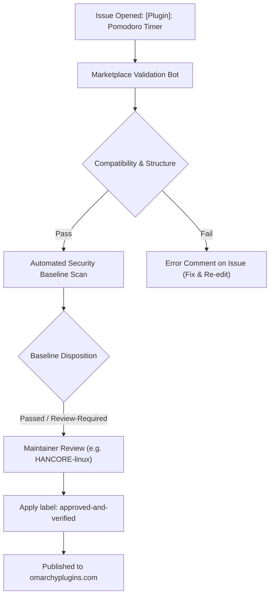

# Omarchy Plugin Marketplace Submission Guide

This document provides complete instructions and pre-filled templates for submitting **Pomodoro Timer** (`pomodoro-omarchy`) to the official [Omarchy Plugin Marketplace](https://github.com/omacom/omarchy-plugin-marketplace) ([omarchyplugins.com](https://omarchyplugins.com/)).

---

## ⚠️ Important Discovery: Plugin ID Uniqueness

> [!WARNING]
> In `omacom/omarchy-plugin-marketplace`, plugin IDs must be globally unique across all repositories.
> Querying the live marketplace registry (`registry.json` and `site/catalog.json`) shows that the ID **`pomodoro`** is **already claimed and listed** by repository [`https://github.com/Macs9319/Pomodoro`](https://github.com/Macs9319/Pomodoro) (author: Ronnie).

The marketplace automated validation runner (`scripts/validate-submission.mjs`) calls `assertSubmissionIsUnlisted()`, which will immediately fail if the ID is already listed:

```javascript
// omacom/omarchy-plugin-marketplace: scripts/validate-submission.mjs
if (listedIds.has(manifest.id)) {
  throw new SubmissionValidationError(
    "plugin-id-listed",
    `Plugin ID "${manifest.id}" is already listed`,
    { pluginId: manifest.id },
  );
}
```

### Recommended Solution: Use ID `pomodoro-omarchy`

Using **`pomodoro-omarchy`** as the plugin ID:
1. Directly matches the repository name `pomodoro-omarchy` (identically to how [`binoymanoj/sys-monitor-omarchy`](https://github.com/binoymanoj/sys-monitor-omarchy) was published).
2. Is 100% available and unlisted in `registry.json` and `site/catalog.json`.
3. Fully complies with the marketplace naming guidelines.

#### Quick 2-Minute Update for ID `pomodoro-omarchy`:

1. **In `manifest.json`**:
   ```json
   "id": "pomodoro-omarchy",
   ```

2. **In `BarWidget.qml`**:
   ```qml
   moduleName: "pomodoro-omarchy"
   ```
   Add a second `IpcHandler` so both `pomodoro-omarchy` and legacy `pomodoro` calls work:
   ```qml
   IpcHandler {
     target: "pomodoro-omarchy"
     function start(work, breakTime) { root.startTimer(work, breakTime) }
     function pause() { root.pauseTimer() }
     function resume() { root.resumeTimer() }
     function togglePause() { root.togglePause() }
     function skip() { root.skipPhase() }
     function stop() { root.stopTimer() }
     function togglePopup() { root.togglePopup() }
   }
   IpcHandler {
     target: "pomodoro"
     function start(work, breakTime) { root.startTimer(work, breakTime) }
     function pause() { root.pauseTimer() }
     function resume() { root.resumeTimer() }
     function togglePause() { root.togglePause() }
     function skip() { root.skipPhase() }
     function stop() { root.stopTimer() }
     function togglePopup() { root.togglePopup() }
   }
   ```

3. **In `bin/omarchy-pomodoro`**:
   ```bash
   send_ipc() {
     local method=$1
     shift || true
     omarchy-shell pomodoro-omarchy "$method" "$@" 2>/dev/null || omarchy-shell pomodoro "$method" "$@" 2>/dev/null || true
   }
   ```

4. **In `~/.config/omarchy/shell.json`**:
   Change `"id": "pomodoro"` to `"id": "pomodoro-omarchy"`.

---

## 📋 Marketplace Listing Metadata

| Field | Value | Notes |
|---|---|---|
| **Repository URL** | `https://github.com/binoymanoj/pomodoro-omarchy` | Must be the public root repository URL |
| **Plugin Title** | `Pomodoro Timer` | Human-readable name for issue title: `[Plugin]: Pomodoro Timer` |
| **Category** | `Productivity` | Official category (case-sensitive) |
| **Tags** | `Bar, Quickshell` | Allowed tags from the marketplace vocabulary (max 3) |
| **Suggest a missing tag** | `Pomodoro` | Optional suggestion for maintainers |
| **Preview Image** | `preview.png` | Located at repo root; 297 KB (under 384 KB card limit) |
| **License** | `MIT` | MIT License file in repository root |

---

## 🚀 How to Submit

You can submit via either the **GitHub CLI (`gh`)** (fastest) or the **GitHub Web UI**.

### Method 1: 1-Click Submission with GitHub CLI (`gh`) (Recommended)

Since you are already authenticated with `gh`, you can submit directly in one command:

```bash
# 1. Create the submission body file
cat > /tmp/omarchy-pomodoro-submission.md <<'EOF'
### Repository URL

https://github.com/binoymanoj/pomodoro-omarchy

### Category

Productivity

### Tags

Bar, Quickshell

### Suggest a missing tag

Pomodoro

### Maintainer notes

Minimal, high-performance Pomodoro timer bar widget and trigger system menu integration for Omarchy Quattro. Displays live remaining session countdown with phase icons, preset templates (25+5, 50+10, 45+15, 20+5), custom durations, sound chimes, native desktop notifications, and an interactive popout control panel. Zero external daemon dependencies, no elevated privileges required.

### Submission checklist

- [x] The repository is public and contains installation and removal instructions.
- [x] I have documented the plugin license and any external dependencies.
- [x] I confirm that I own or have permission to submit this plugin and its preview assets.
- [x] The plugin does not overwrite user configuration without explicit consent.
- [x] I understand that approval is for listing and is not a security review.
EOF

# 2. Submit the issue to the marketplace repository
gh issue create \
  --repo omacom/omarchy-plugin-marketplace \
  --title "[Plugin]: Pomodoro Timer" \
  --body-file /tmp/omarchy-pomodoro-submission.md
```

### Method 2: GitHub Web Interface

1. Open the [Omarchy Plugin Submission Form](https://github.com/omacom/omarchy-plugin-marketplace/issues/new?template=submit-plugin.yml).
2. Fill in the fields:
   - **Repository URL**: `https://github.com/binoymanoj/pomodoro-omarchy`
   - **Category**: Select `Productivity` from the dropdown
   - **Tags**: Select `Bar` and `Quickshell`
   - **Suggest a missing tag**: `Pomodoro`
   - **Maintainer notes**:
     ```text
     Minimal, high-performance Pomodoro timer bar widget and trigger system menu integration for Omarchy Quattro. Displays live remaining session countdown with phase icons, preset templates (25+5, 50+10, 45+15, 20+5), custom durations, sound chimes, native desktop notifications, and an interactive popout control panel. Zero external daemon dependencies, no elevated privileges required.
     ```
   - **Submission checklist**: Check all 5 checkboxes.
3. Click **Submit new issue**.

---

## ⚙️ Automated Pipeline & Verification Lifecycle

Once the issue is opened, the automated marketplace bot begins processing:



### 1. Marketplace Validation Bot
The bot checks:
- Repository is public and reachable (`binoymanoj/pomodoro-omarchy`).
- Valid, uniquely identified plugin manifest (`pomodoro-omarchy`).
- Root `README.md` and `LICENSE` files detected.
- Omarchy Quattro compatibility passed at the validated commit.
- Root preview image detected (`preview.png`).

### 2. Automated Security Baseline Scan
- Statically scans repository files for unsafe patterns (such as unpinned curl-to-bash execution, unauthorized `sudo`/`pkexec` privilege escalations, or writable shared `/tmp` hijacking).
- *Pre-audit result for `pomodoro-omarchy`*: **0** occurrences of `sudo`, `pkexec`, or unpinned network scripts. Clean runtime state handling under `$XDG_RUNTIME_DIR/omarchy-pomodoro`.

### 3. Maintainer Review & Approval
- A marketplace maintainer (such as `HANCORE-linux`) reviews the capability reports.
- Upon approval, the maintainer applies the `approved-and-verified` label.
- The build runner automatically builds the catalog entry and deploys your card to [omarchyplugins.com](https://omarchyplugins.com/plugin.html?id=pomodoro-omarchy).

---

## ✅ Pre-Submission Checklist

Before running `gh issue create`, verify each of the following:

- [x] **Repository is Public**: `https://github.com/binoymanoj/pomodoro-omarchy` is accessible publicly.
- [x] **Git Tree is Clean**: All changes committed and pushed to `master`.
- [x] **Preview Image**: `preview.png` is at repo root and optimized (297 KB <= 384 KB).
- [x] **Manifest Validation**: `omarchy-plugin-validate .` exits with code `0`.
- [x] **README Instructions**: Contains both installation (`omarchy plugin add ...`) and removal instructions (`omarchy plugin remove ...`).
- [ ] **Plugin ID**: Update `manifest.json` from `pomodoro` to `pomodoro-omarchy` to avoid the duplicate ID collision with Ronnie's existing plugin.
