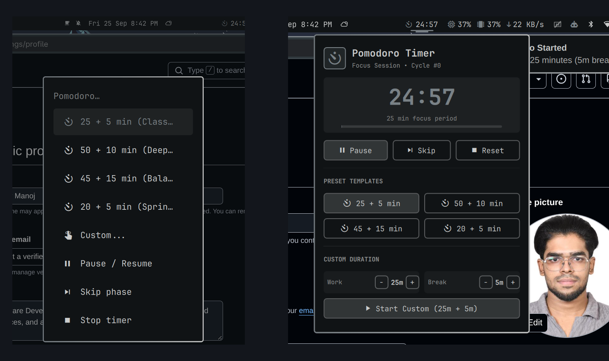
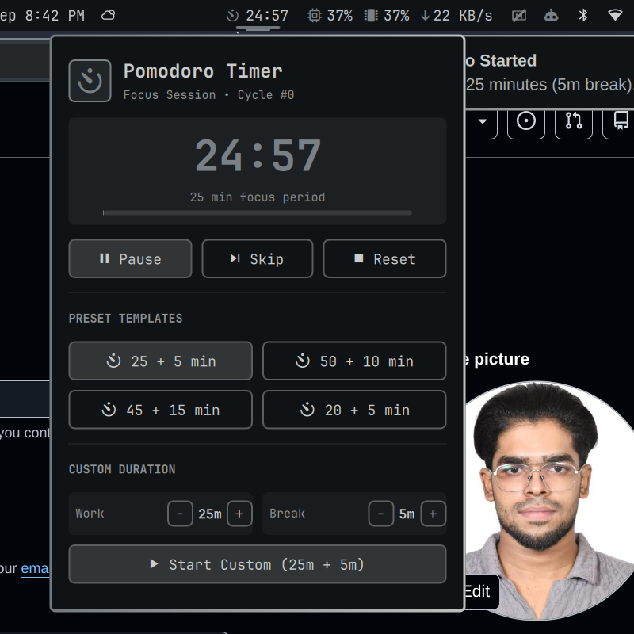
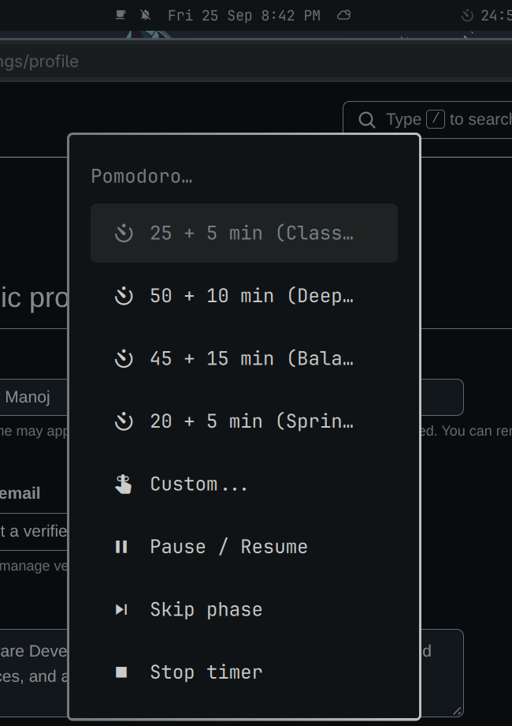

# Pomodoro Timer Plugin for Omarchy

A minimal, high-performance, and distraction-free Pomodoro timer widget and trigger system menu integration for the [Omarchy](https://github.com/omarchy) desktop shell (powered by [Quickshell](https://quickshell.org/)).

Displays live remaining session time with an intuitive phase icon (`󰄉` Focus, `󰤆` Break, `󰏤` Paused) directly in your topbar, backed by preset templates (25+5, 50+10, 45+15, 20+5), custom durations, audio chimes, native desktop notifications, and an interactive popout control panel.



---

## ✨ Features

- **Minimal Topbar Status**:
  - **Live Countdown & Phase Icon**:
    - **Focus Session**: `󰄉 MM:SS` (e.g., `󰄉 24:57`, highlighted in your theme accent color).
    - **Short Break**: `󰤆 MM:SS` (e.g., `󰤆 04:58`, colored in pleasant break green `#98c379`).
    - **Paused**: `󰏤 MM:SS` (dimmed opacity).
    - **Idle**: Minimal icon `󰄉` (configurable visibility).
  - **Orientation-Aware**: Responsive layout adapting to both horizontal and vertical bars.
  - **Quick Bar Mouse Actions**:
    - **Left-Click**: Open the interactive control & template popup card.
    - **Right-Click**: Quick toggle (Pause / Resume active session, or start 25+5 if idle).
    - **Middle-Click**: Stop and reset the timer.

- **Trigger System Menu Integration**:
  - Integrated directly into the Omarchy System Menu (`Super` key -> **Trigger** -> **Pomodoro**), matching the design language of built-in features like Reminders:
    - **󰄉 25 + 5 min (Classic)**: Traditional Pomodoro session.
    - **󰄉 50 + 10 min (Deep Work)**: Extended focus block.
    - **󰄉 45 + 15 min (Balanced)**: Balanced 1-hour study/work block.
    - **󰄉 20 + 5 min (Sprint)**: Short high-intensity sprint.
    - **󰢌 Custom...**: Interactive prompt supporting natural formats (e.g., `25+5`, `50 10`, `30`, or `45/15`).
    - **󰏤 Pause / Resume**: Instantly toggle countdown.
    - **󰒭 Skip phase**: Seamlessly transition between Work and Break.
    - **󰓛 Stop timer**: Reset and return to idle.

- **Interactive Popup Panel**:
  - **Header & Session Tracker**: Current phase indicator and cycle count (`Cycle #1`).
  - **Large Digital Clock**: Big, clear countdown with animated session progress bar.
  - **Quick Playback Controls**: Start / Pause / Resume, Skip, and Reset buttons.
  - **1-Click Preset Grid**: Instant start buttons for `25+5`, `50+10`, `45+15`, and `20+5`.
  - **Custom Duration Steppers**: Quick `[-]` and `[+]` steppers for Work and Break minutes + dedicated Start button.
  - **Keyboard Shortcuts**:
    - `Space`: Pause / Resume
    - `S`: Skip phase
    - `R`: Reset timer
    - `1` - `4`: Select preset templates
    - `Esc`: Dismiss popup

- **Desktop Notifications & Audio Feedback**:
  - Omarchy native desktop notification toasts on start, work completion, and break completion.
  - Audible chime alerts (`alarm-clock-elapsed.oga`) played via `pw-play` on session transition.

- **Zero-Drift & Shell Sync**:
  - Persistent state in `$XDG_RUNTIME_DIR/omarchy-pomodoro/state.json` survives shell restarts without losing elapsed time.
  - Direct Quickshell IPC support via `omarchy-shell pomodoro ...`.

---

## 📸 Screenshots

| Topbar & Interactive Popout Panel | Trigger System Menu Integration |
|:---:|:---:|
|  |  |

---

## 🚀 Installation

### 1. Install via Omarchy Plugin CLI

```bash
omarchy plugin add https://github.com/binoymanoj/pomodoro-omarchy.git --enable --yes
```

To update to the latest version at any time:

```bash
omarchy plugin update pomodoro --yes
```

### 2. Manual Installation (Clone & Symlink)

```bash
git clone https://github.com/binoymanoj/pomodoro-omarchy.git ~/Codes/personal/pomodoro-omarchy
ln -sfn ~/Codes/personal/pomodoro-omarchy ~/.config/omarchy/plugins/pomodoro
ln -sf ~/Codes/personal/pomodoro-omarchy/bin/omarchy-pomodoro ~/.local/bin/omarchy-pomodoro
omarchy-shell shell rescanPlugins
omarchy plugin enable pomodoro
```

### 3. Add to Trigger System Menu

Ensure `~/.config/omarchy/extensions/omarchy-menu.jsonc` contains the `trigger.pomodoro` entries:

```jsonc
{
  "trigger.pomodoro": {
    "icon": "󰄉",
    "label": "Pomodoro",
    "aliases": ["pomodoro", "pomo", "timer"]
  },
  "trigger.pomodoro.classic": {
    "icon": "󰄉",
    "label": "25 + 5 min (Classic)",
    "aliases": ["pomodoro-25", "pomo-25", "25+5"],
    "action": "omarchy-pomodoro start 25 5"
  },
  "trigger.pomodoro.deep": {
    "icon": "󰄉",
    "label": "50 + 10 min (Deep Work)",
    "aliases": ["pomodoro-50", "pomo-50", "50+10"],
    "action": "omarchy-pomodoro start 50 10"
  },
  "trigger.pomodoro.balanced": {
    "icon": "󰄉",
    "label": "45 + 15 min (Balanced)",
    "aliases": ["pomodoro-45", "pomo-45", "45+15"],
    "action": "omarchy-pomodoro start 45 15"
  },
  "trigger.pomodoro.sprint": {
    "icon": "󰄉",
    "label": "20 + 5 min (Sprint)",
    "aliases": ["pomodoro-20", "pomo-20", "20+5"],
    "action": "omarchy-pomodoro start 20 5"
  },
  "trigger.pomodoro.custom": {
    "icon": "󰢌",
    "label": "Custom...",
    "aliases": ["pomodoro-custom", "pomo-custom"],
    "action": "omarchy-pomodoro custom"
  },
  "trigger.pomodoro.toggle-pause": {
    "icon": "󰏤",
    "label": "Pause / Resume",
    "aliases": ["pomodoro-pause", "pomodoro-resume"],
    "action": "omarchy-pomodoro toggle-pause"
  },
  "trigger.pomodoro.skip": {
    "icon": "󰒭",
    "label": "Skip phase",
    "aliases": ["pomodoro-skip"],
    "action": "omarchy-pomodoro skip"
  },
  "trigger.pomodoro.stop": {
    "icon": "󰓛",
    "label": "Stop timer",
    "aliases": ["pomodoro-stop", "pomodoro-reset"],
    "action": "omarchy-pomodoro stop"
  }
}
```

---

## ⌨️ CLI Usage (`omarchy-pomodoro`)

```bash
# Start sessions
omarchy-pomodoro start           # Starts default 25m work + 5m break
omarchy-pomodoro start 50 10     # Starts 50m work + 10m break

# Custom duration prompt
omarchy-pomodoro custom          # Opens interactive duration prompt (e.g. 30+5, 45 15, or 25)

# Session playback
omarchy-pomodoro toggle-pause    # Pause or resume
omarchy-pomodoro pause           # Pause timer
omarchy-pomodoro resume          # Resume timer
omarchy-pomodoro skip            # Skip to next phase (work <-> break)
omarchy-pomodoro stop            # Stop and reset timer

# Status & Popup
omarchy-pomodoro status          # Formatted status output
omarchy-pomodoro status --json   # JSON machine-readable output
omarchy-pomodoro popup           # Toggle the bar popout panel
```

---

## ⚙️ Configuration Schema

Configure in `~/.config/omarchy/shell.json` under your `pomodoro` layout entry:

| Setting | Type | Default | Description |
|---|---|---|---|
| `showWhenIdle` | boolean | `true` | Show the minimal pomodoro icon on the bar even when idle. |
| `defaultWork` | integer | `25` | Default work session duration in minutes. |
| `defaultBreak` | integer | `5` | Default break duration in minutes. |
| `autoStartBreak` | boolean | `true` | Automatically begin break timer when work finishes. |
| `autoStartWork` | boolean | `false` | Automatically begin next work session when break completes. |
| `soundAlert` | boolean | `true` | Play audible chime when sessions complete. |

Example `~/.config/omarchy/shell.json` entry:

```json
{
  "id": "pomodoro",
  "showWhenIdle": true,
  "defaultWork": 25,
  "defaultBreak": 5,
  "autoStartBreak": true,
  "autoStartWork": false,
  "soundAlert": true
}
```

---

## 🗑️ Uninstallation

```bash
omarchy plugin remove pomodoro --yes
```

---

## 📄 License

MIT License © 2026 binoymanoj
